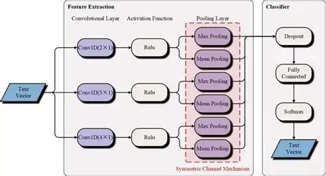
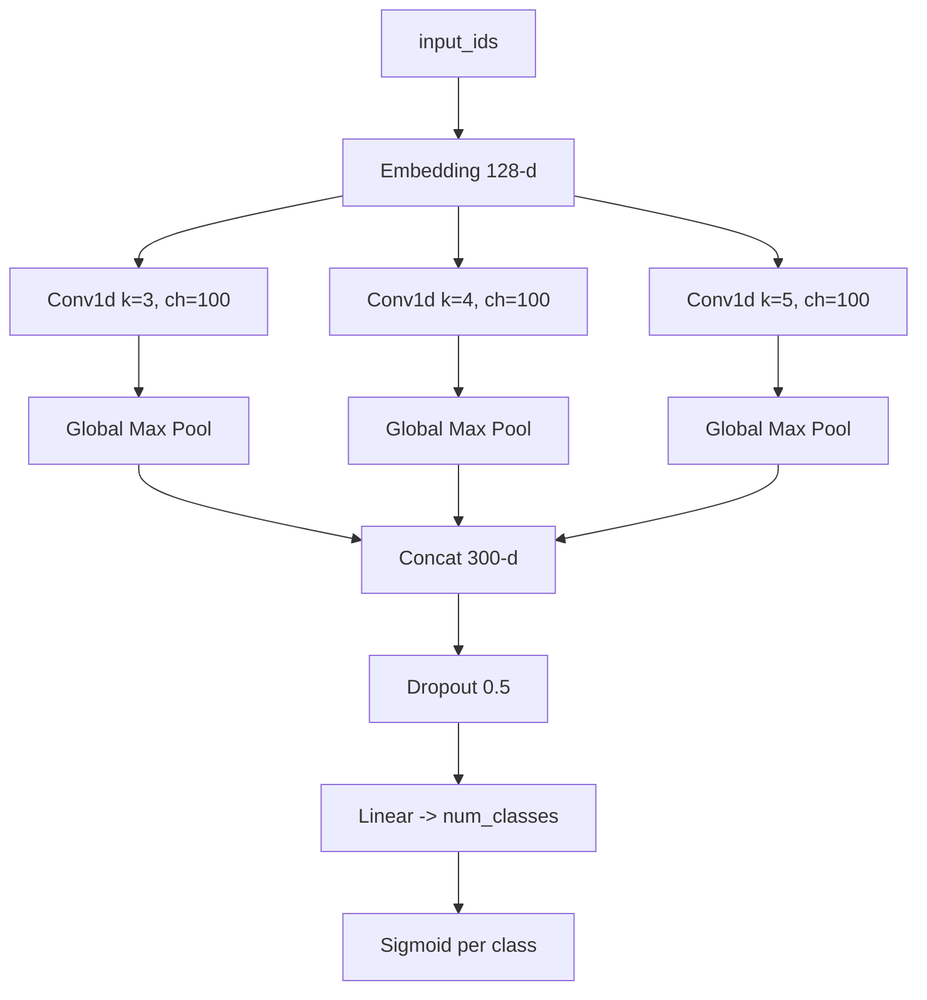
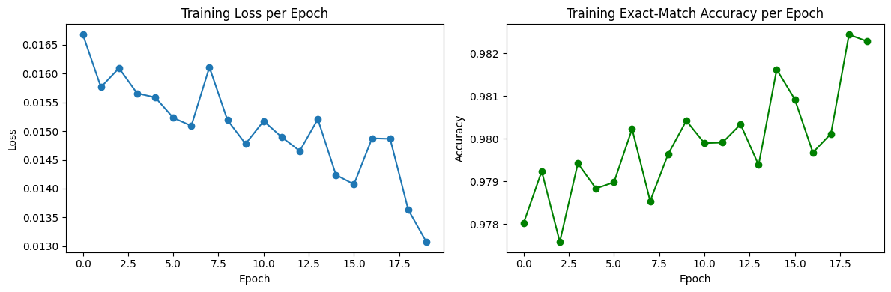
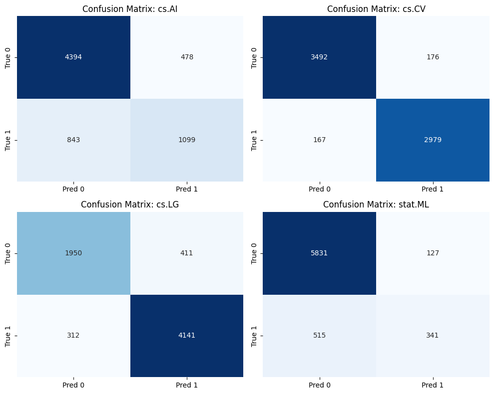

# Tutorial: จับชุดข้อมูล arXiv มา EDA + ทำ Multi-label Classification ด้วย TextCNN

โปรเจกต์นี้เป็นงานสาย NLP ที่ทำครบ flow ตั้งแต่ดูข้อมูล, วิเคราะห์เชิงสถิติ, จนเทรนโมเดล TextCNN สำหรับทำนายหลาย label พร้อมกัน (multi-label text classification) จาก abstract ของงานวิจัย

## ในโปรเจกต์มีอะไรบ้าง

- `ArXiv_MLTC_Datasets_EDA_660710714 (1).ipynb`: โน้ตบุ๊ก EDA
- `TextCNN (1).ipynb`: โน้ตบุ๊กเทรนโมเดล TextCNN
- `arxiv34k6L.csv`: ข้อมูลดิบจาก dataset
- `data.csv`: ข้อมูลที่ผ่านขั้นตอนเตรียมแล้วบางส่วน

## 1. Dataset นี้คืออะไร

ชุดข่อมูลที่ใช้คือ ArXiv Multi-Label Text Classification

ภาพรวมแบบสั้รๆ:

- Input หลัก: Abstracts (ข้อความ abstract)
- Output หลัก: หมวดหมู่ในรูปแบบหลายป้าย เช่น ['cs.LG', 'cs.CV']
- เป็นงาน multi-label: 1 abstract มีได้มากกว่า 1 label
- โครงสร้าง label มีความเป็นลดับชั้น (เช่น parent: cs, stat และ leaf class ย่อย)


## 2. สรุป EDA (อิงจากไฟล์ EDA)

ฝั่ง EDA มีการเช็กหลายมุมพอสมควร ตั้งแต่ missing values ไปจนถึงความสัมพันธ์ระหว่าง label

### สิ่งที่ทำใน EDA 

1. เช็ก missing values ทั้งตาราง
2. ดู class distribution แบบดิบ
3. แยก label ที่ซ้อนกันออกมาเป็น clean_labels
4. นับจำนวนแต่ละ class
5. ดูสถิติการกระจาย: mean, median, std, percentile
6. วาด cumulative coverage ว่าคลาสบนๆ ครอบคลุมข้อมูลกี่ %
7. คำนวณ label cardinality และ label density
8. ทำ label co-occurrence matrix
9. วิเคราะห์ความยาวข้อความ (text length, word count)
10. ดูคำที่พบบ่อย + word cloud
11. สรุป distribution ระดับ parent category
12. ลองทำ TF-IDF + PCA เพื่อดูการกระจายเชิงโครงสร้าง

### ผลสรุปสำคัญจากการทำ EDA

- ข้อมูลมี class imbalance ค่อนข้างชัด (บางคลาสเยอะมาก บางคลาสน้อย)
- หนึ่งตัวอย่างไม่ได้มีแค่ label เดียวตลอด
- ค่า Label Cardinality ประมาณ 1.52 หมายถึงโดยเฉลี่ยหนึ่ง row มีประมาณ 1-2 label
- จากกราฟ co-occurrence เห็นคู่ label ที่ชอบมาด้วยกัน
- PCA 2 มิติช่วยเห็นภาพรวม แต่ยังแยกคลัสเตอร์แบบคมๆ ไม่ได้


## 3. โครงสร้างโมเดล (TextCNN)

โมเดลที่ใช้เป็น TextCNN แบบคลาสสิก แต่เอา input จาก tokenizer ของ bert-base-uncased เพื่อให้ได้ token id ที่มาตรฐาน

### โครงสร้างแบบคร่าว ๆ



### โครงสร้างแบบเห็นภาพ



สรุป:

- Conv หลายขนาด kernel ช่วยจับ pattern ของคำหลายช่วง
- Max pooling ดึง feature ที่เด่นสุดของแต่ละ filter
- ปลายทางเป็น multi-label เลยใช้ **BCEWithLogitsLoss**

## 4. Code แต่ละส่วน + คำอธิบายละเอียด

ด้านล่างคือบล็อกโค้ดหลักๆ ที่ใช้จริงในโน้ตบุ๊ก พร้อมอธิบายว่ามันทำอะไรและทำไปเพื่ออะไร

### 4.1 โหลดข้อมูลและเตรียม label

```python
import pandas as pd
import ast

df = pd.read_csv("data.csv")
df = df.dropna(subset=['clean_labels'])
df["clean_labels"] = df["clean_labels"].apply(ast.literal_eval)

texts = df["Abstracts"].astype(str)
labels = df["clean_labels"]
```

อธิบาย:

- dropna กันแถวที่ไม่มี label ออกก่อน จะได้ไม่พังตอนเทรน
- ast.literal_eval แปลง string ที่หน้าตาเหมือน list ให้เป็น list จริง
- แยก texts กับ labels ให้ชัดไว้ใช้ในขั้นถัดไป

### 4.2 แปลง label เป็นเวกเตอร์ multi-hot

```python
from sklearn.preprocessing import MultiLabelBinarizer

mlb = MultiLabelBinarizer()
y = mlb.fit_transform(labels)
num_classes = len(mlb.classes_)
```

อธิบาย:

- งาน multi-label ต้องให้โมเดลทำนายทีละ class แบบ 0/1
- fit_transform จะเปลี่ยน label list ของแต่ละแถวเป็นเวกเตอร์ เช่น [1,0,1,0]
- num_classes เอาไปกำหนดขนาด output layer

### 4.3 Tokenization

```python
from transformers import AutoTokenizer

tokenizer = AutoTokenizer.from_pretrained("bert-base-uncased")

MAX_LEN = 256
encodings = tokenizer(
	texts.tolist(),
	padding=True,
	truncation=True,
	max_length=MAX_LEN,
	return_tensors="pt"
)
```

อธิบาย:

- ใช้ tokenizer ของ BERT เพื่อให้ token id เสถียรและมาตรฐาน
- padding=True ทำให้ความยาวทุกตัวอย่างเท่ากัน
- truncation=True ตัดข้อความยาวเกิน MAX_LEN เพื่อควบคุม memory และเวลาเทรน

### 4.4 สร้าง Dataset class สำหรับ PyTorch

```python
import torch
from torch.utils.data import Dataset

class PaperDataset(Dataset):
	def __init__(self, encodings, labels):
		self.encodings = encodings
		self.labels = torch.tensor(labels).float()

	def __len__(self):
		return len(self.labels)

	def __getitem__(self, idx):
		item = {key: val[idx] for key, val in self.encodings.items()}
		item["labels"] = self.labels[idx]
		return item
```

อธิบาย:

- ทำให้ DataLoader ดึงข้อมูลเป็น batch ได้สะดวก
- label ต้องเป็น float() เพราะ **BCEWithLogitsLoss** ต้องการค่า float
- ทุกครั้งที่เรียก index จะได้ทั้ง input และ label กลับมา

### 4.5 แบ่ง train/test และทำ DataLoader

```python
from sklearn.model_selection import train_test_split
from torch.utils.data import DataLoader

train_idx, test_idx = train_test_split(
	range(len(texts)),
	test_size=0.2,
	random_state=42
)

train_enc = {k: v[train_idx] for k, v in encodings.items()}
test_enc = {k: v[test_idx] for k, v in encodings.items()}

train_labels = y[train_idx]
test_labels = y[test_idx]

train_dataset = PaperDataset(train_enc, train_labels)
test_dataset = PaperDataset(test_enc, test_labels)

train_loader = DataLoader(train_dataset, batch_size=16, shuffle=True)
test_loader = DataLoader(test_dataset, batch_size=16)
```

อธิบาย:

- split 80/20 สำหรับ train/test
- shuffle=True เฉพาะ train เพื่อกันโมเดลจำลำดับข้อมูล ไม่ทำใน Test set เพราะป้องกันการรั่วลองผลเฉลย
- batch size ใช้ 16 ตามทรัพยากรทั่วไปในงานโน้ตบุ๊ก

### 4.6 นิยามโมเดล TextCNN

```python
import torch.nn as nn
import torch

class TextCNN(nn.Module):
	def __init__(self, vocab_size, embed_dim, num_classes):
		super().__init__()
		self.embedding = nn.Embedding(vocab_size, embed_dim)
		self.convs = nn.ModuleList([
			nn.Conv1d(embed_dim, 100, kernel_size=3),
			nn.Conv1d(embed_dim, 100, kernel_size=4),
			nn.Conv1d(embed_dim, 100, kernel_size=5)
		])
		self.dropout = nn.Dropout(0.5)
		self.fc = nn.Linear(300, num_classes)

	def forward(self, input_ids):
		x = self.embedding(input_ids)
		x = x.permute(0, 2, 1)
		convs = [torch.relu(conv(x)) for conv in self.convs]
		pools = [torch.max(c, dim=2)[0] for c in convs]
		x = torch.cat(pools, dim=1)
		x = self.dropout(x)
		logits = self.fc(x)
		return logits
```

อธิบาย:

- Embedding แปลง token id เป็น dense vector
- permute(0,2,1) เพื่อจัดมิติให้เข้ากับ Conv1d
- Conv 3 ชุด (k=3,4,5) จับ n-gram หลายแบบ
- max-over-time pooling ดึง feature ที่ส่งผลที่สุดของแต่ละ filter
- concat แล้วส่งเข้า linear เพื่อได้ logits ของทุก class

### 4.7 ตั้งค่า loss แล้วเทรน

```python
import torch.optim as optim

vocab_size = tokenizer.vocab_size
model = TextCNN(vocab_size=vocab_size, embed_dim=128, num_classes=num_classes)

device = torch.device("cuda" if torch.cuda.is_available() else "cpu")
model.to(device)

criterion = nn.BCEWithLogitsLoss()
optimizer = optim.Adam(model.parameters(), lr=2e-4)

for epoch in range(100):
	model.train()
	total_loss = 0

	for batch in train_loader:
		input_ids = batch["input_ids"].to(device)
		labels = batch["labels"].to(device)

		optimizer.zero_grad()
		logits = model(input_ids)
		loss = criterion(logits, labels)
		loss.backward()
		optimizer.step()

		total_loss += loss.item()

	print(f"Epoch {epoch+1} Loss:", total_loss / len(train_loader))
```

อธิบาย:

- **BCEWithLogitsLoss** เหมาะกับ multi-label เพราะคำนวณแยกแต่ละ class ได้ตรงโจทย์
- ใช้ Adam ที่ learning rate = 2e-4
- เทรน 100 epoch 

### 4.8 ประเมินผลด้วย Micro F1

```python
from sklearn.metrics import f1_score

model.eval()
all_preds = []

with torch.no_grad():
	for batch in test_loader:
		input_ids = batch["input_ids"].to(device)
		logits = model(input_ids)
		probs = torch.sigmoid(logits)
		preds = (probs > 0.5).int()
		all_preds.append(preds.cpu())

preds = torch.cat(all_preds).numpy()
f1_micro = f1_score(test_labels, preds, average="micro")
print("Micro F1:", f1_micro)
```

อธิบาย:

- แปลง logits ด้วย sigmoid ให้เป็นความน่าจะเป็นรายคลาส
- threshold 0.5 เพื่อเปลี่ยนเป็น 0/1
- ใช้ micro F1 เพราะเหมาะกับงาน multi-label 
- โดย model TextCNN มีค่าประสิทธิภาพโดยประมาณอยู่ที่ 0.848

### 4.9 กราฟแสดง loss และ accuracy

อันนี้คือโค้ดสำหรับเทรนแบบเก็บ history แล้วพล็อตกราฟออกมาเลยในโน้ตบุ๊ก (ใช้ต่อจากโมเดลเดิมได้ทันที)

```python
import numpy as np
import matplotlib.pyplot as plt
from sklearn.metrics import accuracy_score

# ถ้าจะเทรนใหม่เพื่อเก็บ history ให้รันเซลล์นี้
NUM_EPOCHS = 20

train_loss_history = []
train_acc_history = []

for epoch in range(NUM_EPOCHS):
	model.train()
	total_loss = 0.0
	batch_acc = []

	for batch in train_loader:
		input_ids = batch["input_ids"].to(device)
		labels = batch["labels"].to(device)

		optimizer.zero_grad()
		logits = model(input_ids)
		loss = criterion(logits, labels)
		loss.backward()
		optimizer.step()

		total_loss += loss.item()

		# multi-label prediction
		probs = torch.sigmoid(logits)
		preds = (probs > 0.5).int()

		# exact match accuracy ต่อ batch
		acc = accuracy_score(
			labels.detach().cpu().numpy().astype(int),
			preds.detach().cpu().numpy().astype(int)
		)
		batch_acc.append(acc)

	epoch_loss = total_loss / len(train_loader)
	epoch_acc = float(np.mean(batch_acc))

	train_loss_history.append(epoch_loss)
	train_acc_history.append(epoch_acc)

	print(f"Epoch {epoch+1}/{NUM_EPOCHS} - loss: {epoch_loss:.4f} - exact_match_acc: {epoch_acc:.4f}")

# plot loss + accuracy
plt.figure(figsize=(12, 4))

plt.subplot(1, 2, 1)
plt.plot(train_loss_history, marker="o")
plt.title("Training Loss per Epoch")
plt.xlabel("Epoch")
plt.ylabel("Loss")

plt.subplot(1, 2, 2)
plt.plot(train_acc_history, marker="o", color="green")
plt.title("Training Exact-Match Accuracy per Epoch")
plt.xlabel("Epoch")
plt.ylabel("Accuracy")

plt.tight_layout()
plt.show()
```

ภาพผลลัพธ์กราฟ loss และ accuracy:



อธิบายแบบเร็ว:

- ฝั่งซ้ายคือ loss ต่อ epoch: ยิ่งลดลงยิ่งดี
- ฝั่งขวาคือ exact-match accuracy: จะนับว่าถูกก็ต่อเมื่อทาย label ครบทุกตัวของ sample นั้น
- ถ้า loss ลงแต่ accuracy ไม่ขึ้น แปลว่า threshold หรือการกระจายคลาสอาจยังเป็นคอขวด
- จากรูปนี้เห็นว่า loss ค่อยๆ ลดลง และ accuracy ค่อยๆ ไต่ขึ้น แปลว่าโมเดลเรียนรู้ได้ต่อเนื่องและยังไม่เห็นอาการหลุดหนักระหว่างเทรน

### 4.10 ประเมินโมเดล: accuracy และ confusion matrix

โค้ดนี้จะสรุปผลที่อ่านง่ายขึ้น โดยมี accuracy 2 มุม + confusion matrix รายคลาส

```python
import seaborn as sns
import matplotlib.pyplot as plt
from sklearn.metrics import accuracy_score, hamming_loss, multilabel_confusion_matrix

model.eval()
all_preds = []
all_true = []

with torch.no_grad():
	for batch in test_loader:
		input_ids = batch["input_ids"].to(device)
		labels = batch["labels"].to(device)

		logits = model(input_ids)
		probs = torch.sigmoid(logits)
		preds = (probs > 0.5).int()

		all_preds.append(preds.cpu().numpy())
		all_true.append(labels.cpu().numpy().astype(int))

y_pred = np.vstack(all_preds)
y_true = np.vstack(all_true)

# Accuracy แบบ exact match: ต้องทายถูกทุก label ใน 1 sample
exact_match_acc = accuracy_score(y_true, y_pred)

# อีกมุม: label-wise accuracy ผ่าน Hamming
label_wise_acc = 1 - hamming_loss(y_true, y_pred)

print(f"Exact-match accuracy: {exact_match_acc:.4f}")
print(f"Label-wise accuracy (1 - hamming loss): {label_wise_acc:.4f}")

# Confusion matrix แบบแยกราย label (one-vs-rest)
mcm = multilabel_confusion_matrix(y_true, y_pred)

n_classes = len(mlb.classes_)
cols = 2
rows = int(np.ceil(n_classes / cols))

plt.figure(figsize=(10, 4 * rows))
for i in range(n_classes):
	plt.subplot(rows, cols, i + 1)
	sns.heatmap(
		mcm[i],
		annot=True,
		fmt="d",
		cmap="Blues",
		cbar=False,
		xticklabels=["Pred 0", "Pred 1"],
		yticklabels=["True 0", "True 1"]
	)
	plt.title(f"Confusion Matrix: {mlb.classes_[i]}")

plt.tight_layout()
plt.show()
```

ภาพผลลัพธ์ confusion matrix:



อธิบายแบบเข้าใจง่าย:

- Exact-match accuracy โหดกว่า เพราะต้องถูกทั้งชุด label ของ sample นั้น
- Label-wise accuracy ใจดีกว่า เอาความถูกทีละ label มารวมกัน
- confusion matrix จะบอกต่อคลาสว่าโมเดลพลาดแบบไหนบ่อย
- ถ้าเห็น FN เยอะในคลาสไหน แปลว่าโมเดลมักมองไม่เห็นคลาสนั้น (ควรแก้ class imbalance หรือปรับ threshold)
- จากรูปนี้คลาส cs.CV และ cs.LG ค่าทายถูกฝั่ง True 1 ค่อนข้างดี ส่วน stat.ML ยังมี FN สูงพอสมควร เลยเป็นคลาสที่ควรโฟกัสปรับเพิ่ม

## 5. วิธีคำนวณจำนวนพารามิเตอร์ของโมเดล

อันนี้เป็นวิธีนับพารามิเตอร์ของ TextCNN ตัวนี้แบบมือ และดูว่าพารามิเตอร์ไปกองอยู่ตรงไหนเยอะสุด

### 5.1 สูตรที่ใช้

- Embedding: vocab_size x embed_dim
- Conv1d: out_channels x (in_channels x kernel_size + 1)
- Linear: out_features x (in_features + 1)


### 5.2 แทนค่าจากโมเดลนี้

ค่าจากโค้ด:

- vocab_size = 30522 (จาก bert-base-uncased)
- embed_dim = 128
- Conv 3 ชั้น: out_channels = 100, kernel_size = 3,4,5
- Linear: in_features = 300, out_features = num_classes

คำนวณ:

1. Embedding

- 30522 x 128 = 3,906,816

2. Conv1d (k=3)

- 100 x (128 x 3 + 1) = 100 x 385 = 38,500

3. Conv1d (k=4)

- 100 x (128 x 4 + 1) = 100 x 513 = 51,300

4. Conv1d (k=5)

- 100 x (128 x 5 + 1) = 100 x 641 = 64,100

5. Linear

- num_classes x (300 + 1)
- ถ้า num_classes = 4 จะได้ 4 x 301 = 1,204

รวมทั้งหมด :

- 3,906,816 + 38,500 + 51,300 + 64,100 + 1,204 = 4,061,920

สรุปสั้นๆ:

- พารามิเตอร์ส่วนใหญ่จะอยู่ที่ Embedding
- ถ้าอยากลดขนาดโมเดล ให้เริ่มจากลด embed_dim หรือใช้ vocab เล็กลง

### 5.3 เช็กจำนวนพารามิเตอร์ด้วยโค้ด

```python
total_params = sum(p.numel() for p in model.parameters())
trainable_params = sum(p.numel() for p in model.parameters() if p.requires_grad)

print("Total params:", total_params)
print("Trainable params:", trainable_params)
```
---
## 6. สรุปภาพรวม

- EDA ช่วยในการเห็นปัญหา class imbalance และธรรมชาติของ multi-label
- tokenizer แบบ BERT ช่วยให้ดีขึ้น
- TextCNN มีค่าประสิทธิภาพอยู่ที่ประมาณ 0.848